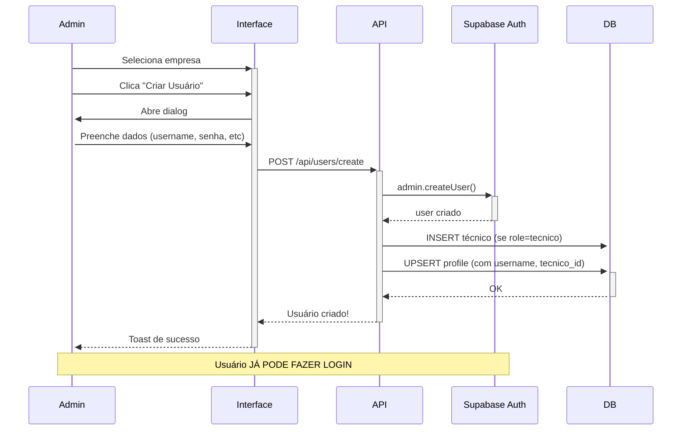

# Refatoração: Cadastro Direto de Usuários

**Data:** 09/12/2025  
**Status:** ✅ Implementado (Aguardando aplicação de migrations)

## 📋 Resumo

Substituído o sistema de convites por e-mail por **cadastro direto** de usuários com username e senha.

## 🎯 Motivação

- ❌ **Antes**: Convite por email → usuário espera → clica no link → preenche dados
- ✅ **Agora**: Admin cria usuário → já pode fazer login imediatamente

### Problemas Resolvidos
1. Dependência de serviço de email
2. Tokens expirando
3. Usuários perdendo convites
4. Fluxo longo e burocrático
5. Tabela `invites` adicional

## 🆕 Arquivos Criados

### 1. API de Cadastro
**`apps/web/src/app/api/users/create/route.ts`**
- POST para criar usuário diretamente
- Usa `supabase.auth.admin.createUser()` (bypassa email)
- Valida username único
- Cria técnico na tabela `tecnicos` se role = 'tecnico'
- Auto-confirma email (`email_confirm: true`)

**Body:**
```json
{
  "username": "joao.silva",
  "password": "senha123",
  "nome": "João da Silva",
  "email": "joao@empresa.com",
  "telefone": "(81) 3333-4444",
  "whatsapp": "(81) 99999-9999",
  "funcao": "Técnico de Manutenção",
  "role": "tecnico",
  "empresa_id": "uuid"
}
```

### 2. Componente de Criação
**`apps/web/src/components/users/user-create-dialog.tsx`**
- Dialog com formulário completo
- Validações:
  - Username: mínimo 3 chars, apenas `[a-zA-Z0-9._-]`
  - Senha: mínimo 8 caracteres
  - Confirmar senha
  - Email válido
  - WhatsApp obrigatório para técnicos
- Máscaras de telefone
- Toggle show/hide password

### 3. Migrations do Banco

**`supabase/migrations/20251209000005_add_username_to_profiles.sql`**
- Adiciona coluna `username text UNIQUE`
- Índice para busca rápida
- Constraint para lowercase e sem espaços
- Popula usernames existentes (baseado em email)
- Resolve duplicatas com sufixo numérico

**`supabase/migrations/20251209000006_create_login_identifier_rpc.sql`**
- RPC `get_email_from_identifier(identifier text)`
- Converte username → email para login
- Se já for email, retorna direto

### 4. Atualização de Login
**`apps/web/src/app/login/page.tsx`**
- Campo alterado de "Email" para "Usuário ou Email"
- Placeholder: `"seu.usuario ou seu@email.com"`
- Lógica:
  1. Se contém `@` → usa como email
  2. Senão → chama RPC para buscar email do username
  3. Faz login com email + senha

### 5. Atualização de Interface
**`apps/web/src/app/(admin)/admin/users/page.tsx`**
- Botão "Convidar" → "Criar Usuário"
- Select para escolher empresa antes de criar
- Integra `UserCreateDialog`
- Mantém dialog antigo de convite (comentado para deprecação)

## 📊 Fluxo Novo



## 🔐 Login com Username

**Antes:**
```
Email: joao.silva@empresa.com
Senha: ••••••••
```

**Agora:**
```
Usuário ou Email: joao.silva   ← pode usar username
Senha: ••••••••
```

**OU**

```
Usuário ou Email: joao@empresa.com   ← também aceita email
Senha: ••••••••
```

## 🗂️ Estrutura de Dados

### Tabela `profiles` (atualizada)

```sql
ALTER TABLE profiles ADD COLUMN username text UNIQUE;
CREATE INDEX idx_profiles_username ON profiles(username);
```

**Exemplo de registro:**
```json
{
  "id": "uuid",
  "user_id": "uuid",
  "username": "joao.silva",       ← NOVO
  "nome": "João da Silva",
  "email": "joao@empresa.com",
  "telefone": "(81) 3333-4444",
  "whatsapp_numero": "(81) 99999-9999",
  "funcao": "Técnico de Manutenção",
  "empresa_id": "uuid",
  "role": "tecnico",
  "active_role": "tecnico",
  "tecnico_id": "uuid",           ← Linkado se role=tecnico
  "is_elisha_admin": false
}
```

## 📦 Aplicação das Migrations

**IMPORTANTE**: Aplicar em **PRODUÇÃO** na seguinte ordem:

```bash
# 1. Adicionar username à tabela profiles
psql -U postgres -h pfgaepysyopkbnlaiucd.supabase.co -d postgres \
  -f supabase/migrations/20251209000005_add_username_to_profiles.sql

# 2. Criar RPC de lookup username → email
psql -U postgres -h pfgaepysyopkbnlaiucd.supabase.co -d postgres \
  -f supabase/migrations/20251209000006_create_login_identifier_rpc.sql
```

**Validação:**
```sql
-- Verificar usernames criados
SELECT username, email, nome FROM profiles WHERE username IS NOT NULL LIMIT 10;

-- Testar RPC
SELECT get_email_from_identifier('joao.silva');
SELECT get_email_from_identifier('joao@empresa.com');
```

## ✅ Checklist de Deploy

- [x] API `/api/users/create` criada
- [x] Componente `UserCreateDialog` implementado
- [x] Migration `20251209000005_add_username_to_profiles.sql` criada
- [x] Migration `20251209000006_create_login_identifier_rpc.sql` criada
- [x] Login atualizado para aceitar username
- [x] Interface de gestão atualizada
- [x] Documentação `SISTEMA_CONVITES_OBSOLETO.md` criada
- [ ] **Aplicar migrations em PRODUÇÃO**
- [ ] **Testar criação de usuário**
- [ ] **Testar login com username**
- [ ] **Testar login com email**
- [ ] Monitorar logs por 48h
- [ ] (Futuro) Remover sistema de convites após 2-3 semanas

## 🧪 Testes Manuais

### 1. Criar Usuário Admin
1. Login como elisha_admin
2. Acessar `/admin/users`
3. Selecionar empresa
4. Clicar "Criar Usuário"
5. Preencher:
   - Username: `admin.teste`
   - Senha: `senha123456`
   - Nome: `Admin Teste`
   - Email: `admin.teste@empresa.com`
   - Role: Admin
6. Submeter
7. Verificar toast de sucesso

### 2. Criar Técnico
1. Mesmos passos acima
2. Role: Técnico
3. **WhatsApp obrigatório**
4. Verificar que `tecnicos` table foi populada
5. Verificar que `profile.tecnico_id` foi linkado

### 3. Login com Username
1. Logout
2. Acessar `/login`
3. Usuário ou Email: `admin.teste`
4. Senha: `senha123456`
5. Clicar "Entrar"
6. Verificar redirecionamento para dashboard

### 4. Login com Email
1. Logout
2. Acessar `/login`
3. Usuário ou Email: `admin.teste@empresa.com`
4. Senha: `senha123456`
5. Clicar "Entrar"
6. Verificar redirecionamento para dashboard

## 🚨 Rollback (se necessário)

Se houver problema crítico:

```sql
-- Remover coluna username (perde dados!)
ALTER TABLE profiles DROP COLUMN IF EXISTS username;

-- Remover RPC
DROP FUNCTION IF EXISTS get_email_from_identifier(text);

-- Reverter login para email-only (git revert no frontend)
```

## 📝 Notas Técnicas

1. **Usernames são case-insensitive**: sempre convertidos para lowercase
2. **Email continua necessário**: para recuperação de senha
3. **Sistema antigo de convites mantido**: não deletado, apenas deprecado
4. **Backward compatible**: usuários antigos continuam funcionando
5. **Migração automática**: usernames gerados a partir do email (antes do @)

## 🔗 Documentos Relacionados

- `SISTEMA_CONVITES_OBSOLETO.md` - Detalhes da deprecação
- `INSTRUCOES_MIGRATIONS_CHECKOUT.md` - Ordem de todas as migrations
- `LEIA-ME-PRIMEIRO.md` - Guia geral do sistema
